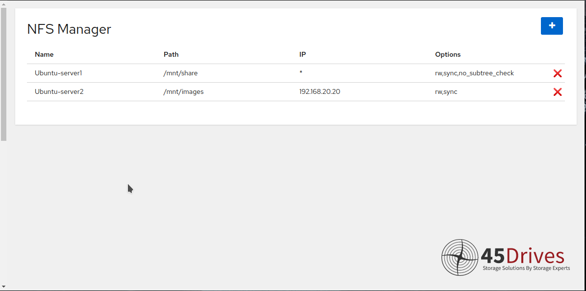
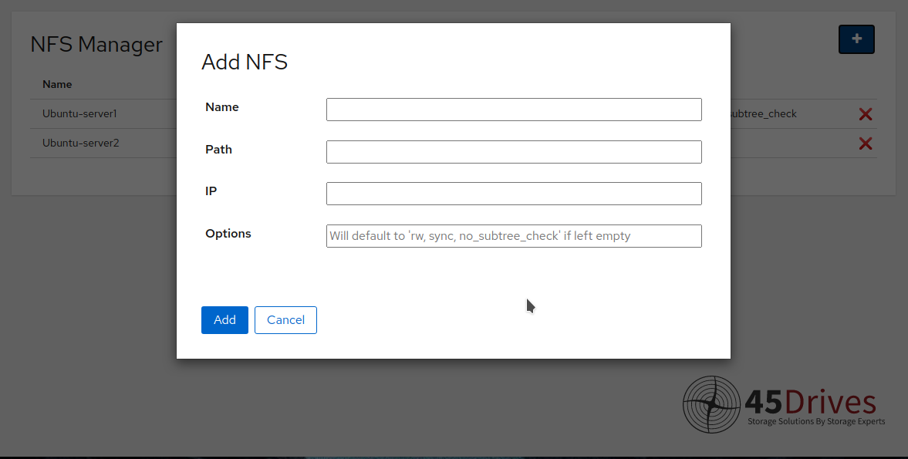
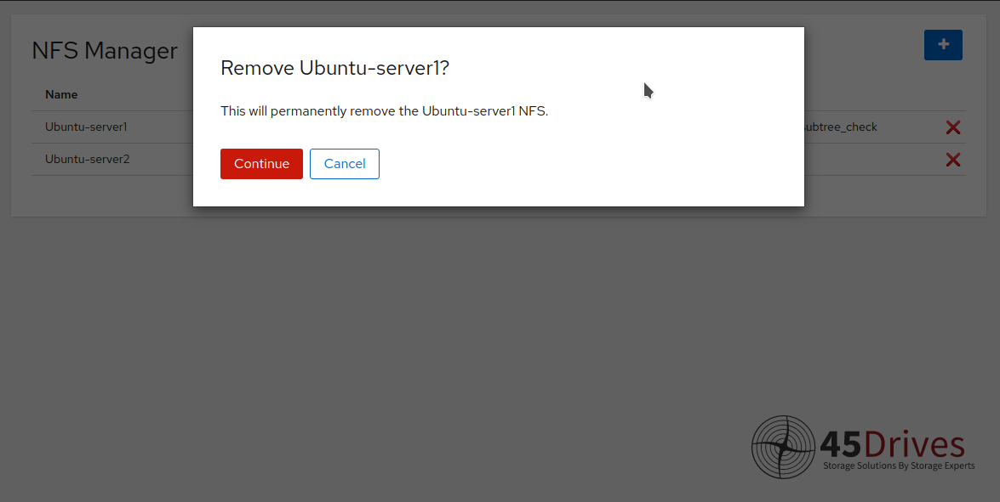

This module is no longer updated. Please check https://github.com/45Drives/cockpit-file-sharing for the latest version.

# cockpit-nfs-manager
Cockpit plugin and CLI tool to manage NFS(s)

### Managing NFS(s)

NFS Manager is an easy way to add and configure multiple NFSs at once.

### Adding a NFS

Adding a NFS is easy and customizable. You have the ability to fully customizable options or leave the defaults.

### Removing a NFS

Removing a NFS is just as easy. With a couple clicks the NFS will be off your server!

# Installation

## From Source
1. `$ git clone https://github.com/45Drives/cockpit-nfs-manager.git`
1. `$ cd cockpit-nfs-manager`
1. `# make install`
